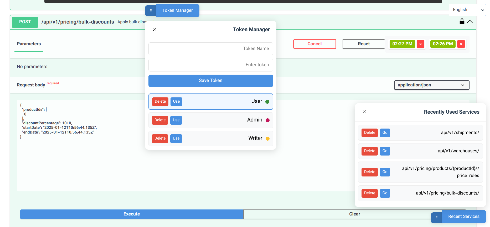

  

<h1 align="center">SwaggerProPlus</h1>

    Enhanced Swagger UI with Intelligent Features

  <a href="src/docs/README_en.md">English</a> |
  <a href="src/docs/README_fa.md">فارسی</a> |
  <a href="src/docs/README_ar.md">العربية</a> |
  <a href="src/docs/README_az.md">Azərbaycan</a> |
  <a href="src/docs/README_ru.md">Русский</a> |
  <a href="src/docs/README_tr.md">Türkçe</a>

## Online Demo

Experience SwaggerProPlus in action:
- **Demo URL**: http://patoghjobs.com:8088/sw-pro.html

## Key Features

- 🔑 **Smart Token Management**: Store and switch between multiple environment tokens
- 📝 **Request History**: Auto-save last 5 requests per API endpoint
- 🔍 **Quick Access**: Smart listing of frequently used services
- 🌐 **Multi-language Support**: Interface available in 6 languages
- 🎨 **Visual Environment Indicators**: Color-coded favicons and titles

## Practical Usage Guide

### Token Management
1. Click the "Token Manager" button in the top-left corner
2. Add new tokens:
   - Enter token name (e.g., "Production", "Testing")
   - Paste your token
   - Click Save
3. Use the color indicators to easily identify different environments
4. Quick switch between environments with one click

### Request History
1. Execute any API request
2. Your last 5 requests are automatically saved
3. Access history by clicking the "Try it out" button
4. Click on any previous request to restore its parameters

### Quick Access
1. Recently used APIs appear at the bottom of the screen
2. Click "Go" to instantly navigate to that API
3. Manage your frequently used services list with simple controls

### Language Selection
- Use the language dropdown in the top-right corner
- Interface language is saved automatically
- All features available in all supported languages

## Support

- Website: https://patoghjobs.com
- Email: dev@patoghjobs.com

---

Made with ❤️ by PatoghJobs Team

