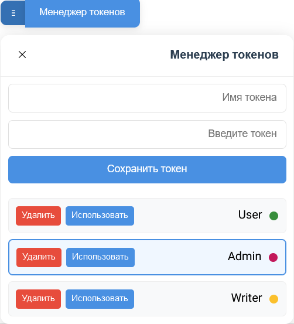
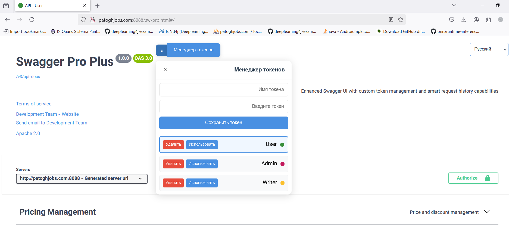
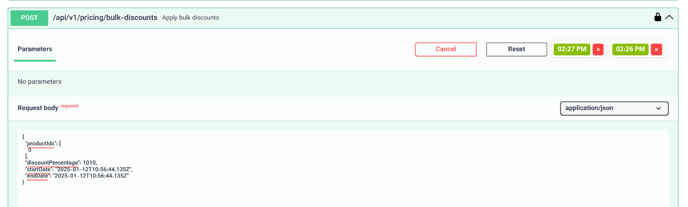
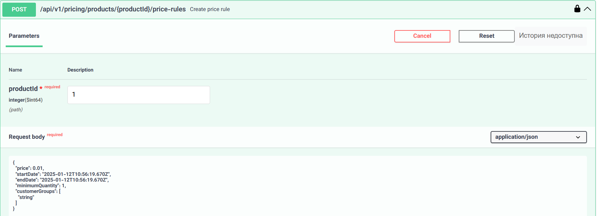
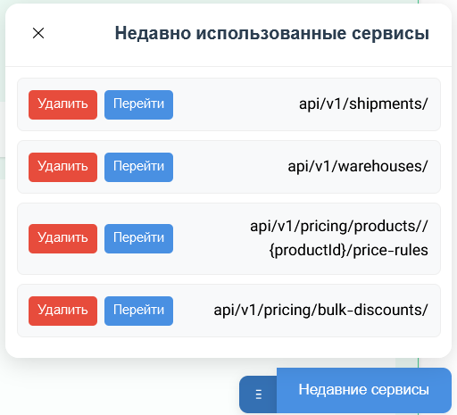
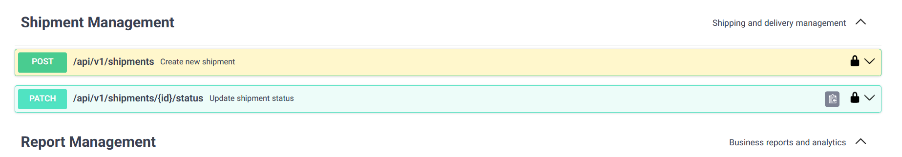
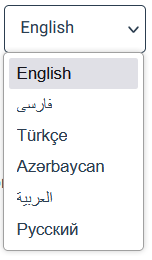

# SwaggerProPlus - Интеллектуальный инструмент управления Swagger UI

SwaggerProPlus преобразует работу с API, добавляя интеллектуальные функции в Swagger UI.

## Содержание 📑
- [Ключевые преимущества](#ключевые-преимущества-)
- [Установка и настройка](#установка-и-настройка-%EF%B8%8F)
- [Руководство пользователя](#руководство-пользователя-)
- [Устранение неполадок](#устранение-неполадок-)
- [Поддержка](#поддержка-)
- [Лицензия](#лицензия-)

## Ключевые преимущества 🚀

### Интеллектуальное управление токенами
**Ключевые функции:**
- **Хранение нескольких токенов** с разными именами для разных сред
- **Быстрое определение активной среды** по цвету фавикона и заголовку страницы
- **Быстрое переключение** между токенами одним кликом
- **Перемещаемая панель управления** для адаптации к вашему рабочему пространству

**Преимущества:**
- **Повышенная концентрация**: Устранение необходимости в копировании/вставке и снижение человеческих ошибок
- **Улучшенное управление**: Четкое разделение рабочих сред
- **Экономия времени**: Сокращение времени на управление токенами на 60%




### Умная история API
**Ключевые функции:**
- **Автоматическая запись** последних пяти запросов для каждого API
- **Быстрое восстановление** параметров и содержимого запросов
- **Простое управление историей** с возможностью удаления

**Преимущества:**
- **Лучшая концентрация**: Уменьшение необходимости повторного ввода параметров
- **Более быстрое тестирование**: Повторное использование успешных предыдущих запросов
- **Повышенная производительность**: Сокращение времени на тестирование и разработку API на 50%




### Быстрый доступ к сервисам
**Ключевые функции:**
- **Умный список** пяти недавно использованных API
- **Автоматическая навигация** к нужному API
- **Интеллектуальное выделение** для быстрой идентификации

**Преимущества:**
- **Лучший фокус**: Устранение длительного поиска и навигации
- **Более плавный рабочий процесс**: Мгновенный доступ к часто используемым API
- **Повышенная эффективность**: Сокращение времени доступа к API на 45%




### Многоязычный интерфейс
**Ключевые функции:**
- **Поддержка 7 языков** для международных команд
- **Сохраняемые настройки** для пользовательских предпочтений
- **Унифицированный интерфейс** для всех языков

**Преимущества:**
- **Улучшенное сотрудничество**: Лучшая коммуникация в многоязычных командах
- **Улучшенный UX**: Использование интерфейса на родном языке
- **Гибкость**: Сокращение времени на обучение и документацию на 40%



## Установка и настройка ⚡️

### Шаг 1: Получение файлов
Скачайте последнюю версию с [SwaggerProPlus](https://github.com/username/SwaggerProPlus/releases).

### Шаг 2: Структура файлов
Разместите файлы в следующей структуре:
```plaintext
src/main/resources/
├── static/
│   ├── js/
│   │   ├── i18n-config.js      # Управление многоязычностью
│   │   ├── swagger-custom.js   # Управление токенами
│   │   ├── last-five.js        # Недавние сервисы
│   │   └── request.js          # История запросов
│   ├── css/
│   │   └── swagger-custom.css  # Пользовательские стили
│   └── sw-pro.html            # Главная страница
```


### Шаг 3: Настройка Spring Boot
Создайте файл `application.properties` или `application.yml`:
```properties
# Базовые настройки
spring.application.name=swaggerProPlus
server.port=8088

# Настройки Swagger UI
springdoc.swagger-ui.path=/swagger.html
springdoc.api-docs.path=/v3/api-docs
springdoc.swagger-ui.enabled=true
springdoc.api-docs.enabled=true
```


### Шаг 4: Запуск
1. Запустите проект Spring Boot
2. Перейдите по адресу `http://patoghjobs.com:8088/sw-pro.html`
3. Увидите Swagger UI с новыми функциями


## Руководство пользователя 📚

### Управление токенами
1. Нажмите кнопку "Менеджер токенов" вверху страницы
2. Создайте новый токен для каждой среды:
    - Введите имя среды (например: разработка, тест, продакшн)
    - Введите токен
    - Нажмите "Сохранить"
3. Токены сохраняются с разными цветами
4. Для активации токена нажмите "Использовать"


### История запросов
- История автоматически сохраняется для каждого API
- Для восстановления параметров нажмите на временную метку
- Для удаления из истории дважды нажмите "Удалить"


### Недавние сервисы
- Список пяти последних API отображается внизу
- Для быстрого доступа нажмите "Перейти"
- Сервисы сортируются по использованию


### Смена языка
- Используйте выпадающее меню языков вверху страницы
- Настройки сохраняются автоматически


## Устранение неполадок 🔧

### Белый экран или ошибка загрузки
1. Проверьте пути к файлам в папке static
2. Проверьте консоль браузера на наличие ошибок
3. Убедитесь в корректной установке Swagger UI

### Проблемы с токенами
1. Убедитесь, что localStorage браузера включен
2. Обновите страницу
3. Повторно введите токен

### Отсутствует история
1. Убедитесь, что память браузера не очищена
2. Используйте обновленные браузеры

## Поддержка 💬

### Сообщение о проблемах
Для сообщения о проблемах и предложений свяжитесь с командой разработки по email dev@patoghjobs.com.

### Демо-версия
Для просмотра живого демо и тестирования функциональности посетите:
http://patoghjobs.com:8088/sw-pro.html

### Связь с нами
- Веб-сайт: https://patoghjobs.com
- Email: dev@patoghjobs.com

## Лицензия 📝
Этот проект лицензирован под Apache License 2.0.

---

**Примечание:** Все скриншоты можно найти в директории `docs/images/screenshots/` с соответствующими языковыми суффиксами.
